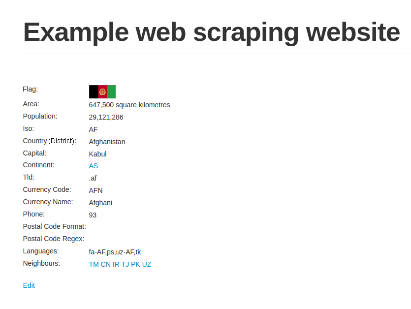

# 第1章　网络爬虫简介

欢迎来到网络爬虫的广阔天地！网络爬虫被用于许多领域，收集不太容易以其他格式获取的数据。你可能是正在撰写新报道的记者，也可能是正在抽取新数据集的数据科学家。即使你只是临时的开发人员，网络爬虫也是非常有用的工具，比如当你需要检查大学网站上最新的家庭作业并且希望通过邮件发送给你时。无论你的动机是什么，我们都希望你已经准备好开始学习了！

在本章中，我们将介绍如下主题：

- 网络爬虫领域简介；
- 解释合法性质疑；
- 介绍Python 3安装；
- 对目标网站进行背景调研；
- 逐步完善一个高级网络爬虫；
- 使用非标准库协助抓取网站。

## 1.1　网络爬虫何时有用

假设我有一个鞋店，并且想要及时了解竞争对手的价格。我可以每天访问他们的网站，与我店铺中鞋子的价格进行对比。但是，如果我店铺中的鞋类品种繁多，或是希望能够更加频繁地查看价格变化的话，就需要花费大量的时间，甚至难以实现。再举一个例子，我看中了一双鞋，想等到它促销时再购买。我可能需要每天访问这家鞋店的网站来查看这双鞋是否降价，也许需要等待几个月的时间，我才能如愿盼到这双鞋促销。上述这两个重复性的手工流程，都可以利用本书介绍的网络爬虫技术实现自动化处理。

在理想状态下，网络爬虫并不是必需品，每个网站都应该提供API，以结构化的格式共享它们的数据。然而在现实情况中，虽然一些网站已经提供了这种API，但是它们通常会限制可以抓取的数据，以及访问这些数据的频率。另外，网站开发人员可能会变更、移除或限制其后端API。总之，我们不能仅仅依赖于API去访问我们所需的在线数据，而是应该学习一些网络爬虫技术的相关知识。

## 1.2　网络爬虫是否合法

尽管在过去20年间已经做出了诸多相关裁决，不过网络爬虫及其使用时法律所允许的内容仍然处于建设当中。如果被抓取的数据用于个人用途，且在合理使用版权法的情况下，通常没有问题。但是，如果这些数据会被重新发布，并且抓取行为的攻击性过强导致网站宕机，或者其内容受版权保护，抓取行为违反了其服务条款的话，那么则有一些法律判例可以提及。

在 Feist Publications, Inc. 起诉 Rural Telephone Service Co.的案件中，美国联邦最高法院裁定抓取并转载真实数据（比如，电话清单）是允许的。在澳大利亚，Telstra Corporation Limited 起诉 Phone Directories Company Pty Ltd 这一类似案件中，则裁定只有拥有明确作者的数据，才可以受到版权的保护。而在另一起发生于美国的美联社起诉融文集团的内容抓取案件中，则裁定对美联社新闻重新聚合为新产品的行为是侵犯版权的。此外，在欧盟的 ofir.dk起诉 home.dk 一案中，最终裁定定期抓取和深度链接是允许的。

还有一些案件中，原告控告一些公司抓取强度过大，尝试通过法律手段停止其抓取行为。在最近的QVC诉讼Resultly的案件中，最终裁定除非抓取行为造成了私人财产损失，否则不能被认定为故意侵害，即使爬虫活动导致了部分站点的可用性问题。

这些案件告诉我们，当抓取的数据是现实生活中真实的公共数据（比如，营业地址、电话清单）时，在遵守合理的使用规则的情况下是允许转载的。但是，如果是原创数据（比如，意见和评论或用户隐私数据），通常就会受到版权限制，而不能转载。无论如何，当你抓取某个网站的数据时，请记住自己是该网站的访客，应当约束自己的抓取行为，否则他们可能会封禁你的IP，甚至采取更进一步的法律行动。这就要求下载请求的速度需要限定在一个合理值之内，并且还需要设定一个专属的用户代理来标识自己的爬虫。你还应该设法查看网站的服务条款，确保你所获取的数据不是私有或受版权保护的内容。

如果你还有疑虑或问题，可以向媒体律师咨询你所在地区的相关判例。

你可以自行搜索下述法律案件的更多信息。

- Feist Publications Inc. 起诉 Rural Telephone Service Co. 的案件。
- Telstra Corporation Limited 起诉 Phone Directories Company Pvt Ltd 的案件。
- 美联社起诉融文集团的案件。
- ofir.dk 起诉 home.dk 的案件。
- QVC 起诉 Resultly的案件。

## 1.3　Python 3

在本书中，我们将完全使用Python 3进行开发。Python软件基金会已经宣布Python 2将会被逐步淘汰，并且只支持到2020年；出于该原因，我们和许多其他Python爱好者一样，已经将开发转移到对Python 3的支持当中，在本书中我们将使用3.6版本。本书代码将兼容Python 3.4+的版本。

如果你熟悉`Python Virtual Environments`或`Anaconda`的使用，那么你可能已经知道如何在一个新环境中创建Python 3了。如果你希望以全局形式安装Python 3，那么我们推荐你搜索自己使用的操作系统的特定文档。就我而言，我会直接使用**Virtual Environment Wrapper**（`https://virtualenvwrapper.readthedocs.io/en/latest`），这样就可以很容易地对不同项目和Python版本使用多个不同的环境了。使用Conda环境或虚拟环境是最为推荐的，这样你就可以轻松变更基于项目需求的依赖，而不会影响到你正在做的其他工作了。对于初学者来说，我推荐使用Conda，因为其需要的安装工作更少一些。

Conda的介绍文档（`https://conda.io/docs/intro.html`）是一个不错的开始！

>  
>
> 从此刻开始，所有代码和命令都假设你已正确安装Python 3并且正在使用Python 3.4+的环境。如果你看到了导入或语法错误，请检查你是否处于正确的环境当中，查看跟踪信息中是否存在Python 2.7的文件路径。

## 1.4　背景调研

在深入讨论爬取一个网站之前，我们首先需要对目标站点的规模和结构进行一定程度的了解。网站自身的`robots.txt`和`Sitemap`文件都可以为我们提供一定的帮助，此外还有一些能提供更详细信息的外部工具，比如Google搜索和`WHOIS`。

### 1.4.1　检查robots.txt

大多数网站都会定义`robots.txt`文件，这样可以让爬虫了解爬取该网站时存在哪些限制。这些限制虽然是仅仅作为建议给出，但是良好的网络公民都应当遵守这些限制。在爬取之前，检查`robots.txt`文件这一宝贵资源可以将爬虫被封禁的可能性降至最低，而且还能发现和网站结构相关的线索。关于`robots.txt`协议的更多信息可以参见`http://www.robotstxt.org`。下面的代码是我们的示例文件`robots.txt`中的内容，可以访问`http://example.python-scraping.com/robots.txt`获取。

```
# section 1
User-agent: BadCrawler
Disallow: /

# section 2
User-agent: *
Crawl-delay: 5
Disallow: /trap

# section 3
Sitemap: http://example.python-scraping.com/sitemap.xml
```

在section 1中，`robots.txt`文件禁止用户代理为BadCrawler的爬虫爬取该网站，不过这种写法可能无法起到应有的作用，因为恶意爬虫根本不会遵从`robots.txt`的要求。本章后面的一个例子将会展示如何让爬虫自动遵守`robots.txt`的要求。

section 2规定，无论使用哪种用户代理，都应该在两次下载请求之间给出5秒的抓取延迟，我们需要遵从该建议以避免服务器过载。这里还有一个`/trap`链接，用于封禁那些爬取了不允许访问的链接的恶意爬虫。如果你访问了这个链接，服务器就会封禁你的IP一分钟！一个真实的网站可能会对你的IP封禁更长时间，甚至是永久封禁。不过如果这样设置的话，我们就无法继续这个例子了。

section 3定义了一个`Sitemap`文件，我们将在下一节中了解如何检查该文件。

### 1.4.2　检查网站地图

网站提供的`Sitemap`文件（即网站地图）可以帮助爬虫定位网站最新的内容，而无须爬取每一个网页。如果想要了解更多信息，可以从`http://www.sitemaps.org/protocol.html`获取网站地图标准的定义。许多网站发布平台都有自动生成网站地图的能力。下面是在`robots.txt`文件中定位到的`Sitemap`文件的内容。

```
<?xml version="1.0" encoding="UTF-8"?>
<urlset xmlns="http://www.sitemaps.org/schemas/sitemap/0.9">
  <url><loc>http://example.python-scraping.com/view/Afghanistan-1</loc>
  </url>
  <url><loc>http://example.python-scraping.com/view/Aland-Islands-2</loc>
  </url>
  <url><loc>http://example.python-scraping.com/view/Albania-3</loc>
  </url>
  ...
</urlset>
```

网站地图提供了所有网页的链接，我们会在后面的小节中使用这些信息，用于创建我们的第一个爬虫。虽然`Sitemap`文件提供了一种爬取网站的有效方式，但是我们仍需对其谨慎处理，因为该文件可能存在缺失、过期或不完整的问题。

### 1.4.3　估算网站大小

目标网站的大小会影响我们如何进行爬取。如果是像我们的示例站点这样只有几百个URL的网站，效率并没有那么重要；但如果是拥有数百万个网页的站点，使用串行下载可能需要持续数月才能完成，这时就需要使用第4章中介绍的分布式下载来解决了。

估算网站大小的一个简便方法是检查Google爬虫的结果，因为Google很可能已经爬取过我们感兴趣的网站。我们可以通过Google搜索的`site`关键词过滤域名结果，从而获取该信息。我们可以从`http://www.google.com/advanced_search`了解到该接口及其他高级搜索参数的用法。

在域名后面添加URL路径，可以对结果进行过滤，仅显示网站的某些部分。

同样，你的结果可能会有所不同；不过，这种附加的过滤条件非常有用，因为在理想情况下，你只希望爬取网站中包含有用数据的部分，而不是爬取网站的每个页面。

### 1.4.4　识别网站所用技术

构建网站所使用的技术类型也会对我们如何爬取产生影响。有一个十分有用的工具可以检查网站构建的技术类型——`detectem`模块，该模块需要Python 3.5+环境以及Docker。如果你还没有安装Docker，可以遵照`https://www.docker.com/products/overview`中你使用的操作系统所对应的说明操作。当Docker安装好后，你可以运行如下命令。

```
docker pull scrapinghub/splash
pip install detectem
```

上述操作将从ScrapingHub拉取最新的Docker镜像，并通过`pip`安装该库。为了确保不受任何更新或改动的影响，推荐使用Python虚拟环境（`https://docs.python.org/3/library/venv.html`）或Conda环境（`https://conda.io/docs/using/envs.html`），并查看项目的ReadMe页面（`https://github.com/spectresearch/detectem`）。

> 　**为什么使用环境？**　
>
> 假设你的项目使用了早期版本的库进行开发（比如`detectem`），而在最新的版本中，`detectem`引入了一些向后不兼容的变更，造成你的项目无法正常工作。但是，你正在开发的其他项目中，可能使用了更新的版本。如果你的项目使用系统中安装的`detectem`，那么当更新库以支持其他项目时，该项目就会无法运行。
>
> Ian Bicking的`virtualenv`为解决该问题提供了一个巧妙的解决方法，该方法通过复制系统中Python的可执行程序及其依赖到一个本地目录中，创建了一个独立的Python环境。这就能够让一个项目安装指定版本的Python库，而不依赖于外部系统。你还可以在不同的虚拟环境中使用不同的Python版本。Conda环境中使用了Anaconda的Python路径，提供了相似的功能。

`detectem`模块基于许多扩展模块，使用一系列请求和响应，来探测网站使用的技术。它使用了Splash，这是由ScrapingHub开发的一个脚本化浏览器。要想运行该模块，只需使用`det`命令即可。

```
$ det http://example.python-scraping.com
[('jquery', '1.11.0')]
```

我们可以看到示例网站使用了通用的JavaScript库，因此其内容很可能嵌入在HTML当中，相对来说应该比较容易抓取。

`detectem`仍然相当年轻，旨在成为Wappalyzer的Python对标版本，Wappalyzer是一个基于Node.js的项目，支持解析不同后端、广告网络、JavaScript库以及服务器设置。你也可以在Docker中运行Wappalyzer。首先需要下载其Docker镜像，运行如下命令。

```
$ docker pull wappalyzer/cli
```

然后，你可以从Docker实例中运行脚本。

```
$ docker run wappalyzer/cli http://example.python-scraping.com
```

输出结果不太容易阅读，不过当我们将其拷贝到JSON解析器中，可以看到检测出来的很多库和技术。

```
{'applications':
[{'categories': ['Javascript Frameworks'],
     'confidence': '100',
     'icon': 'Modernizr.png',
     'name': 'Modernizr',
     'version': ''},
 {'categories': ['Web Servers'],
     'confidence': '100',
     'icon': 'Nginx.svg',
     'name': 'Nginx',
     'version': ''},
 {'categories': ['Web Frameworks'],
     'confidence': '100',
     'icon': 'Twitter Bootstrap.png',
     'name': 'Twitter Bootstrap',
     'version': ''},
 {'categories': ['Web Frameworks'],
     'confidence': '100',
     'icon': 'Web2py.png',
     'name': 'Web2py',
     'version': ''},
 {'categories': ['Javascript Frameworks'],
     'confidence': '100',
     'icon': 'jQuery.svg',
     'name': 'jQuery',
     'version': ''},
 {'categories': ['Javascript Frameworks'],
     'confidence': '100',
     'icon': 'jQuery UI.svg',
     'name': 'jQuery UI',
     'version': '1.10.3'},
 {'categories': ['Programming Languages'],
     'confidence': '100',
     'icon': 'Python.png',
     'name': 'Python',
     'version': ''}],
 'originalUrl': 'http://example.python-scraping.com',
 'url': 'http://example.python-scraping.com'}
```

从上面可以看出，检测结果认为Python和`web2py`框架具有很高的可信度。我们还可以看到网站使用了前端CSS框架Twitter Bootstrap。Wappalyzer还检测到网站使用了Modernizer.js以及用于后端服务器的Nginx。由于网站只使用了JQuery和Modernizer，那么网站不太可能全部页面都是通过JavaScript加载的。而如果改用AngularJS或React构建该网站的话，此时的网站内容很可能就是动态加载的了。另外，如果网站使用了ASP.NET，那么在爬取网页时，就必须要用到会话管理和表单提交了。对于这些更加复杂的情况，我们会在第5章和第6章中进行介绍。

### 1.4.5　寻找网站所有者

对于一些网站，我们可能会关心其所有者是谁。比如，我们已知网站的所有者会封禁网络爬虫，那么我们最好把下载速度控制得更加保守一些。为了找到网站的所有者，我们可以使用`WHOIS`协议查询域名的注册者是谁。Python中有一个针对该协议的封装库，其文档地址为`https://pypi.python.org/pypi/python-whois`，我们可以通过`pip`进行安装。

```
pip install python-whois
```

下面是使用该模块对`appspot.com`这个域名进行`WHOIS`查询时返回结果的核心部分。

```
>>> import whois
>>> print(whois.whois('appspot.com'))
  {
    ...
    "name_servers": [
      "NS1.GOOGLE.COM",
      "NS2.GOOGLE.COM",
      "NS3.GOOGLE.COM",
      "NS4.GOOGLE.COM",
      "ns4.google.com",
      "ns2.google.com",
      "ns1.google.com",
      "ns3.google.com"
    ],
    "org": "Google Inc.",
    "emails": [
      "abusecomplaints@markmonitor.com",
      "dns-admin@google.com"
    ]
  }
```

从结果中可以看出该域名归属于Google，实际上也确实如此。该域名是用于Google App Engine服务的。Google经常会阻断网络爬虫，尽管实际上其自身就是一个网络爬虫业务。当我们爬取该域名时需要十分小心，因为Google经常会阻断抓取其服务过快的IP；而你，或与你生活或工作在一起的人，可能需要使用Google的服务。我经历过在使用Google服务一段时间后，被要求输入验证码的情况，甚至只是在对Google域名运行了简单的搜索爬虫之后。

## 1.5　编写第一个网络爬虫

为了抓取网站，我们首先需要下载包含有感兴趣数据的网页，该过程一般称为**爬取（crawling）**。爬取一个网站有很多种方法，而选用哪种方法更加合适，则取决于目标网站的结构。本章中，我们首先会探讨如何安全地下载网页，然后会介绍如下3种爬取网站的常见方法：

- 爬取网站地图；
- 使用数据库ID遍历每个网页；
- 跟踪网页链接。

到目前为止，我们交替使用了抓取和爬取这两个术语，接下来让我们先来定义这两种方法的相似点和不同点。

### 1.5.1　抓取与爬取的对比

根据你所关注的信息以及站点内容和结构的不同，你可能需要进行网络抓取或是网站爬取。那么它们有什么区别呢？

网络抓取通常针对特定网站，并在这些站点上获取指定信息。网络抓取用于访问这些特定的页面，如果站点发生变化或者站点中的信息位置发生变化的话，则需要进行修改。例如，你可能想要通过网络抓取查看你喜欢的当地餐厅的每日特色菜，为了实现该目的，你需要抓取其网站中日常更新该信息的部分。

与之不同的是，网络爬取通常是以通用的方式构建的，其目标是一系列顶级域名的网站或是整个网络。爬取可以用来收集更具体的信息，不过更常见的情况是爬取网络，从许多不同的站点或页面中获取小而通用的信息，然后跟踪链接到其他页面中。

除了爬取和抓取外，我们还会在第8章中介绍网络爬虫。爬虫可以用来爬取指定的一系列网站，或是在多个站点甚至整个互联网中进行更广泛的爬取。

一般来说，我们会使用特定的术语反映我们的用例。在你开发网络爬虫时，可能会注意到它们在你想要使用的技术、库和包中的区别。在这些情况下，你对不同术语的理解，可以帮助你基于所使用的术语选择适当的包或技术（例如，是否只用于抓取？是否也适用于爬虫？）。

### 1.5.2　下载网页

要想抓取网页，我们首先需要将其下载下来。下面的示例脚本使用Python的`urllib`模块下载URL。

```
import urllib.request
def download(url):
    return urllib.request.urlopen(url).read()
```

当传入URL参数时，该函数将会下载网页并返回其HTML。不过，这个代码片段存在一个问题，即当下载网页时，我们可能会遇到一些无法控制的错误，比如请求的页面可能不存在。此时，`urllib`会抛出异常，然后退出脚本。安全起见，下面再给出一个更稳建的版本，可以捕获这些异常。

```
import urllib.request
from urllib.error import URLError, HTTPError, ContentTooShortError

def download(url):
    print('Downloading:', url)
    try:
        html = urllib.request.urlopen(url).read()
    except (URLError, HTTPError, ContentTooShortError) as e:
        print('Download error:', e.reason)
        html = None
    return html
```

现在，当出现下载或URL错误时，该函数能够捕获到异常，然后返回`None`。

> 　
>
> 在本书中，我们将假设你在文件中编写代码，而不是使用提示符的方式（如上述代码所示）。当你发现代码以Python提示符 >>> 或IPython提示符 `In [1]:`开始时，你需要将其输入到正在使用的主文件中，或是保存文件后，在Python解释器中导入这些函数和类。

#### 1．重试下载

下载时遇到的错误经常是临时性的，比如服务器过载时返回的`503 Service Unavailable`错误。对于此类错误，我们可以在短暂等待后尝试重新下载，因为这个服务器问题现在可能已经解决。不过，我们不需要对所有错误都尝试重新下载。如果服务器返回的是`404 Not Found`这种错误，则说明该网页目前并不存在，再次尝试同样的请求一般也不会出现不同的结果。

互联网工程任务组（Internet Engineering Task Force）定义了HTTP错误的完整列表，从中可以了解到`4xx`错误发生在请求存在问题时，而`5xx`错误则发生在服务端存在问题时。所以，我们只需要确保`download`函数在发生`5xx`错误时重试下载即可。下面是支持重试下载功能的新版本代码。

```
def download(url, num_retries=2):
    print('Downloading:', url)
    try:
        html = urllib.request.urlopen(url).read()
    except (URLError, HTTPError, ContentTooShortError) as e:
        print('Download error:', e.reason)
        html = None
        if num_retries > 0:
               if hasattr(e, 'code') and 500 <= e.code < 600:
             # recursively retry 5xx HTTP errors
             return download(url, num_retries - 1)
    return html
```

现在，当`download`函数遇到`5xx`错误码时，将会递归调用函数自身进行重试。此外，该函数还增加了一个参数，用于设定重试下载的次数，其默认值为两次。我们在这里限制网页下载的尝试次数，是因为服务器错误可能暂时还没有恢复。想要测试该函数，可以尝试下载`http://httpstat.us/500`，该网址会始终返回`500`错误码。

```
    >>> download('http://httpstat.us/500')
Downloading: http://httpstat.us/500
Download error: Internal Server Error
Downloading: http://httpstat.us/500
Download error: Internal Server Error
Downloading: http://httpstat.us/500
Download error: Internal Server Error
```

从上面的返回结果可以看出，`download`函数的行为和预期一致，先尝试下载网页，在接收到`500`错误后，又进行了两次重试才放弃。

#### 2．设置用户代理

默认情况下，`urllib`使用`Python-urllib/3.x`作为用户代理下载网页内容，其中`3.x`是环境当前所用Python的版本号。如果能使用可辨识的用户代理则更好，这样可以避免我们的网络爬虫碰到一些问题。此外，也许是因为曾经历过质量不佳的Python网络爬虫造成的服务器过载，一些网站还会封禁这个默认的用户代理。

因此，为了使下载网站更加可靠，我们需要控制用户代理的设定。下面的代码对`download`函数进行了修改，设定了一个默认的用户代理`‘wswp’`（即**Web Scraping with Python**的首字母缩写）。

```
def download(url, user_agent='wswp', num_retries=2):
    print('Downloading:', url)
    request = urllib.request.Request(url)
    request.add_header('User-agent', user_agent)
    try:
        html = urllib.request.urlopen(request).read()
    except (URLError, HTTPError, ContentTooShortError) as e:
        print('Download error:', e.reason)
        html = None
        if num_retries > 0:
            if hasattr(e, 'code') and 500 <= e.code < 600:
                # recursively retry 5xx HTTP errors
                return download(url, num_retries - 1)
    return html
```

现在，如果你再次尝试访问`meetup.com`，就能够看到一个合法的HTML了。我们的下载函数可以在后续代码中得到复用，该函数能够捕获异常、在可能的情况下重试网站以及设置用户代理。

### 1.5.3　网站地图爬虫

在第一个简单的爬虫中，我们将使用示例网站`robots.txt`文件中发现的网站地图来下载所有网页。为了解析网站地图，我们将会使用一个简单的正则表达式，从`<loc>`标签中提取出URL。

我们需要更新代码以处理编码转换，因为我们目前的`download`函数只是简单地返回了字节。而在下一章中，我们将会介绍一种更加稳健的解析方法——**CSS选择器**。下面是该示例爬虫的代码。

```
import re

def download(url, user_agent='wswp', num_retries=2, charset='utf-8'):
    print('Downloading:', url)
    request = urllib.request.Request(url)
    request.add_header('User-agent', user_agent)
    try:
        resp = urllib.request.urlopen(request)
        cs = resp.headers.get_content_charset()
        if not cs:
            cs = charset
        html = resp.read().decode(cs)
    except (URLError, HTTPError, ContentTooShortError) as e:
        print('Download error:', e.reason)
        html = None
        if num_retries > 0:
            if hasattr(e, 'code') and 500 <= e.code < 600:
            # recursively retry 5xx HTTP errors
            return download(url, num_retries - 1)
    return html

def crawl_sitemap(url):
    # download the sitemap file
    sitemap = download(url)
    # extract the sitemap links
    links = re.findall('<loc>(.*?)</loc>', sitemap)
    # download each link
    for link in links:
        html = download(link)
        # scrape html here
        # ...
```

现在，运行网站地图爬虫，从示例网站中下载所有国家或地区页面。

```
    >>> crawl_sitemap('http://example.python-scraping.com/sitemap.xml')
Downloading: http://example.python-scraping.com/sitemap.xml
Downloading: http://example.python-scraping.com/view/Afghanistan-1
Downloading: http://example.python-scraping.com/view/Aland-Islands-2
Downloading: http://example.python-scraping.com/view/Albania-3
... 
```

正如上面代码中的`download`方法所示，我们必须更新字符编码才能利用正则表达式处理网站响应。Python的`read`方法返回字节，而正则表达式期望的则是字符串。我们的代码依赖于网站维护者在响应头中包含适当的字符编码。如果没有返回字符编码头部，我们将会把它设置为默认值UTF-8，并抱有最大的希望。当然，如果返回头中的编码不正确，或是编码没有设置并且也不是UTF-8的话，则会抛出错误。还有一些更复杂的方式用于猜测编码（参见`https://pypi.python.org/pypi/chardet`），该方法非常容易实现。

到目前为止，网站地图爬虫已经符合预期。不过正如前文所述，我们无法依靠`Sitemap`文件提供每个网页的链接。下一节中，我们将会介绍另一个简单的爬虫，该爬虫不再依赖于`Sitemap`文件。

> 　
>
> 如果你在任何时候不想再继续爬取，可以按下Ctrl + C或cmd + C退出Python解释器或执行的程序。

### 1.5.4　ID遍历爬虫

本节中，我们将利用网站结构的弱点，更加轻松地访问所有内容。下面是一些示例国家（或地区）的URL。

- http://example.python-scraping.com/view/Afghanistan-1
- http://example.python-scraping.com/view/Australia-2
- http://example.python-scraping.com/view/Brazil-3

可以看出，这些URL只在URL路径的最后一部分有所区别，包括国家（或地区）名（作为页面别名）和ID。在URL中包含页面别名是非常普遍的做法，可以对搜索引擎优化起到帮助作用。一般情况下，Web服务器会忽略这个字符串，只使用ID来匹配数据库中的相关记录。下面我们将其移除，查看`http://example.python-scraping.com/view/1`，测试示例网站中的链接是否仍然可用。测试结果如图1.1所示。



图1.1

从图1.1中可以看出，网页依然可以加载成功，也就是说该方法是有用的。现在，我们就可以忽略页面别名，只利用数据库ID来下载所有国家（或地区）的页面了。下面是使用了该技巧的代码片段。

```
import itertools

def crawl_site(url):
    for page in itertools.count(1):
        pg_url = '{}{}'.format(url, page)
        html = download(pg_url)
        if html is None:
            break
        # success - can scrape the result
```

现在，我们可以使用该函数传入基础URL。

```
>>> crawl_site('http://example.python-scraping.com/view/-')
Downloading: http://example.python-scraping.com/view/-1
Downloading: http://example.python-scraping.com/view/-2
Downloading: http://example.python-scraping.com/view/-3
Downloading: http://example.python-scraping.com/view/-4
[...]
```

在这段代码中，我们对ID进行遍历，直到出现下载错误时停止，我们假设此时抓取已到达最后一个国家（或地区）的页面。不过，这种实现方式存在一个缺陷，那就是某些记录可能已被删除，数据库ID之间并不是连续的。此时，只要访问到某个间隔点，爬虫就会立即退出。下面是这段代码的改进版本，在该版本中连续发生多次下载错误后才会退出程序。

```
def crawl_site(url, max_errors=5):
    for page in itertools.count(1):
        pg_url = '{}{}'.format(url, page)
        html = download(pg_url)
        if html is None:
            num_errors += 1
            if num_errors == max_errors:
                # max errors reached, exit loop
                break
        else:
            num_errors = 0
            # success - can scrape the result
```

上面代码中实现的爬虫需要连续5次下载错误才会停止遍历，这样就很大程度上降低了遇到记录被删除或隐藏时过早停止遍历的风险。

在爬取网站时，遍历ID是一个很便捷的方法，但是和网站地图爬虫一样，这种方法也无法保证始终可用。比如，一些网站会检查页面别名是否在URL中，如果不是，则会返回`404 Not Found`错误。而另一些网站则会使用非连续大数作为ID，或是不使用数值作为ID，此时遍历就难以发挥其作用了。例如，Amazon使用ISBN作为可用图书的ID，这种编码包含至少10位数字。使用ID对ISBN进行遍历需要测试数十亿次可能的组合，因此这种方法肯定不是抓取该站内容最高效的方法。

正如你一直关注的那样，你可能已经注意到一些`TOO MANY REQUESTS`下载错误信息。现在无须担心它，我们将会在1.5.5节的“高级功能”部分中介绍更多处理该类型错误的方法。

### 1.5.5　链接爬虫

到目前为止，我们已经利用示例网站的结构特点实现了两个简单爬虫，用于下载所有已发布的国家（或地区）页面。只要这两种技术可用，就应当使用它们进行爬取，因为这两种方法将需要下载的网页数量降至最低。不过，对于另一些网站，我们需要让爬虫表现得更像普通用户，跟踪链接，访问感兴趣的内容。

通过跟踪每个链接的方式，我们可以很容易地下载整个网站的页面。但是，这种方法可能会下载很多并不需要的网页。例如，我们想要从一个在线论坛中抓取用户账号详情页，那么此时我们只需要下载账号页，而不需要下载讨论贴的页面。本章使用的链接爬虫将使用正则表达式来确定应当下载哪些页面。下面是这段代码的初始版本。

```
import re

def link_crawler(start_url, link_regex):
    """ Crawl from the given start URL following links matched by
link_regex
    """
    crawl_queue = [start_url]
    while crawl_queue:
        url = crawl_queue.pop()
        html = download(url)
        if html is not None:
            continue
        # filter for links matching our regular expression
        for link in get_links(html):
            if re.match(link_regex, link):
                crawl_queue.append(link)

def get_links(html):
    """ Return a list of links from html
    """
    # a regular expression to extract all links from the webpage
    webpage_regex = re.compile("""<a[^>]+href=["'](.*?)["']""",
re.IGNORECASE)
    # list of all links from the webpage
    return webpage_regex.findall(html)
```

要运行这段代码，只需要调用`link_crawler`函数，并传入两个参数：要爬取的网站URL以及用于匹配你想跟踪的链接的正则表达式。对于示例网站来说，我们想要爬取的是国家（或地区）列表索引页和国家（或地区）页面。

我们查看站点可以得知索引页链接遵循如下格式：

- http://example.python-scraping.com/index/1
- http://example.python-scraping.com/index/2

国家（或地区）页遵循如下格式：

- http://example.python-scraping.com/view/Afghanistan-1
- http://example.python-scraping.com/view/Aland-Islands-2

因此，我们可以用`/(index|view)/`这个简单的正则表达式来匹配这两类网页。当爬虫使用这些输入参数运行时会发生什么呢？你会得到如下所示的下载错误。

```
>>> link_crawler('http://example.python-scraping.com', '/(index|view)/')
Downloading: http://example.python-scraping.com
Downloading: /index/1
Traceback (most recent call last):
    ...
ValueError: unknown url type: /index/1
```

> 　
>
> 正则表达式是从字符串中抽取信息的非常好的工具，因此我推荐每名程序员都应当“学会如何阅读和编写一些正则表达式”。即便如此，它们往往会非常脆弱，容易失效。我们将在本书后续部分介绍更先进的抽取链接和识别页面的方式。

可以看出，问题出在下载`/index/1`时，该链接只有网页的路径部分，而没有协议和服务器部分，也就是说这是一个**相对链接**。由于浏览器知道你正在浏览哪个网页，并且能够采取必要的步骤处理这些链接，因此在浏览器浏览时，相对链接是能够正常工作的。但是，`urllib`并没有上下文。为了让`urllib`能够定位网页，我们需要将链接转换为**绝对链接**的形式，以便包含定位网页的所有细节。如你所愿，Python的`urllib`中有一个模块可以用来实现该功能，该模块名为`parse`。下面是`link_crawler`的改进版本，使用了`urljoin`方法来创建绝对路径。

```
from urllib.parse import urljoin

def link_crawler(start_url, link_regex):
    """ Crawl from the given start URL following links matched by
link_regex
    """
    crawl_queue = [start_url]
    while crawl_queue:
        url = crawl_queue.pop()
        html = download(url)
        if not html:
            continue
        for link in get_links(html):
            if re.match(link_regex, link):
                abs_link = urljoin(start_url, link)
                crawl_queue.append(abs_link)
```

当你运行这段代码时，会看到虽然下载了匹配的网页，但是同样的地点总是会被不断下载到。产生该行为的原因是这些地点相互之间存在链接。比如，澳大利亚链接到了南极洲，而南极洲又链接回了澳大利亚，此时爬虫就会继续将这些URL放入队列，永远不会到达队列尾部。要想避免重复爬取相同的链接，我们需要记录哪些链接已经被爬取过。下面是修改后的`link_crawler`函数，具备了存储已发现URL的功能，可以避免重复下载。

```
def link_crawler(start_url, link_regex):
    crawl_queue = [start_url]
    # keep track which URL's have seen before
    seen = set(crawl_queue)
    while crawl_queue:
        url = crawl_queue.pop()
        html = download(url)
        if not html:
            continue
        for link in get_links(html):
            # check if link matches expected regex
            if re.match(link_regex, link):
            abs_link = urljoin(start_url, link)
            # check if have already seen this link
            if abs_link not in seen:
                seen.add(abs_link)
                crawl_queue.append(abs_link)
```

当运行该脚本时，它会爬取所有地点，并且能够如期停止。最终，我们得到了一个可用的链接爬虫！

### 高级功能

现在，让我们为链接爬虫添加一些功能，使其在爬取其他网站时更加有用。

#### 1．解析robots.txt

首先，我们需要解析`robots.txt`文件，以避免下载禁止爬取的URL。使用Python的`urllib`库中的`robotparser`模块，就可以轻松完成这项工作，如下面的代码所示。

```
    >>> from urllib import robotparser
>>> rp = robotparser.RobotFileParser()
>>> rp.set_url('http://example.python-scraping.com/robots.txt')
>>> rp.read()
>>> url = 'http://example.python-scraping.com'
>>> user_agent = 'BadCrawler'
>>> rp.can_fetch(user_agent, url)
False
>>> user_agent = 'GoodCrawler'
>>> rp.can_fetch(user_agent, url)
True
```

`robotparser`模块首先加载`robots.txt`文件，然后通过`can_fetch()`函数确定指定的用户代理是否允许访问网页。在本例中，当用户代理设置为`'BadCrawler'`时，`robotparser`模块的返回结果表明无法获取网页，正如我们在示例网站的`robots.txt`文件中看到的定义一样。

为了将`robotparser`集成到链接爬虫中，我们首先需要创建一个新函数用于返回`robotparser`对象。

```
def get_robots_parser(robots_url):
    " Return the robots parser object using the robots_url "
    rp = robotparser.RobotFileParser()
    rp.set_url(robots_url)
    rp.read()
    return rp
```

我们需要可靠地设置`robots_url`，此时我们可以通过向函数传递额外的关键词参数的方法实现这一目标。我们还可以设置一个默认值，防止用户没有传递该变量。假设从网站根目录开始爬取，那么我们可以简单地将`robots.txt`添加到URL的结尾处。此外，我们还需要定义`user_agent`。

```
def link_crawler(start_url, link_regex, robots_url=None,
user_agent='wswp'):
    ...
    if not robots_url:
        robots_url = '{}/robots.txt'.format(start_url)
    rp = get_robots_parser(robots_url)
```

最后，我们在`crawl`循环中添加解析器检查。

```
...
while crawl_queue:
    url = crawl_queue.pop()
    # check url passes robots.txt restrictions
    if rp.can_fetch(user_agent, url):
        html = download(url, user_agent=user_agent)
        ...
    else:
        print('Blocked by robots.txt:', url)
```

我们可以通过使用坏的用户代理字符串来测试我们这个高级链接爬虫以及`robotparser`的使用。

```
>>> link_crawler('http://example.python-scraping.com', '/(index|view)/',
user_agent='BadCrawler')
Blocked by robots.txt: http://example.python-scraping.com
```

#### 2．支持代理

有时我们需要使用代理访问某个网站。比如，Hulu在美国以外的很多国家被屏蔽，YouTube上的一些视频也是。使用`urllib`支持代理并没有想象中那么容易。我们将在后面的小节介绍一个对用户更友好的Python HTTP模块——`requests`，该模块同样也能够处理代理。下面是使用`urllib`支持代理的代码。

```
proxy = 'http://myproxy.net:1234' # example string
proxy_support = urllib.request.ProxyHandler({'http': proxy})
opener = urllib.request.build_opener(proxy_support)
urllib.request.install_opener(opener)
# now requests via urllib.request will be handled via proxy
```

下面是集成了该功能的新版本`download`函数。

```
def download(url, user_agent='wswp', num_retries=2, charset='utf-8',
proxy=None):
    print('Downloading:', url)
    request = urllib.request.Request(url)
    request.add_header('User-agent', user_agent)
    try:
        if proxy:
            proxy_support = urllib.request.ProxyHandler({'http': proxy})
            opener = urllib.request.build_opener(proxy_support)
            urllib.request.install_opener(opener)
        resp = urllib.request.urlopen(request)
        cs = resp.headers.get_content_charset()
        if not cs:
            cs = charset
        html = resp.read().decode(cs)
    except (URLError, HTTPError, ContentTooShortError) as e:
        print('Download error:', e.reason)
        html = None
        if num_retries > 0:
            if hasattr(e, 'code') and 500 <= e.code < 600:
            # recursively retry 5xx HTTP errors
            return download(url, num_retries - 1)
    return html
```

目前在默认情况下（Python 3.5），`urllib`模块不支持`https`代理。该问题可能会在Python未来的版本中发现变化，因此请查阅最新的文档。此外，你还可以使用文档推荐的诀窍（`https://code.activestate.com/recipes/456195`），或继续阅读来学习如何使用`requests`库。

#### 3．下载限速

如果我们爬取网站的速度过快，就会面临被封禁或是造成服务器过载的风险。为了降低这些风险，我们可以在两次下载之间添加一组延时，从而对爬虫限速。下面是实现了该功能的类的代码。

```
from urllib.parse import urlparse
import time

class Throttle:
    """Add a delay between downloads to the same domain
    """
    def __init__(self, delay):
    # amount of delay between downloads for each domain
    self.delay = delay
    # timestamp of when a domain was last accessed
    self.domains = {}

def wait(self, url):
    domain = urlparse(url).netloc
    last_accessed = self.domains.get(domain)

    if self.delay > 0 and last_accessed is not None:
        sleep_secs = self.delay - (time.time() - last_accessed)
        if sleep_secs > 0:
            # domain has been accessed recently
            # so need to sleep
            time.sleep(sleep_secs)
    # update the last accessed time
    self.domains[domain] = time.time()
```

`Throttle`类记录了每个域名上次访问的时间，如果当前时间距离上次访问时间小于指定延时，则执行睡眠操作。我们可以在每次下载之前调用`throttle`对爬虫进行限速。

```
throttle = Throttle(delay)
...
throttle.wait(url)
html = download(url, user_agent=user_agent, num_retries=num_retries,
                proxy=proxy, charset=charset)
```

#### 4．避免爬虫陷阱

目前，我们的爬虫会跟踪所有之前没有访问过的链接。但是，一些网站会动态生成页面内容，这样就会出现无限多的网页。比如，网站有一个在线日历功能，提供了可以访问下个月和下一年的链接，那么下个月的页面中同样会包含访问再下个月的链接，这样就会一直持续请求到部件设定的最大时间（可能会是很久之后的时间）。该站点可能还会在简单的分页导航中提供相同的功能，本质上是分页请求不断访问空的搜索结果页，直至达到最大页数。这种情况被称为**爬虫陷阱**。

想要避免陷入爬虫陷阱，一个简单的方法是记录到达当前网页经过了多少个链接，也就是深度。当到达最大深度时，爬虫就不再向队列中添加该网页中的链接了。要实现最大深度的功能，我们需要修改`seen`变量。该变量原先只记录访问过的网页链接，现在修改为一个字典，增加了已发现链接的深度记录。

```
def link_crawler(..., max_depth=4):
    seen = {}
    ...
    if rp.can_fetch(user_agent, url):
        depth = seen.get(url, 0)
        if depth == max_depth:
            print('Skipping %s due to depth' % url)
            continue
        ...
        for link in get_links(html):
            if re.match(link_regex, link):
                abs_link = urljoin(start_url, link)
                if abs_link not in seen:
                    seen[abs_link] = depth + 1
                    crawl_queue.append(abs_link)
```

有了该功能之后，我们就有信心爬虫最终一定能够完成了。如果想要禁用该功能，只需将`max_depth`设为一个负数即可，此时当前深度永远不会与之相等。

#### 5．最终版本

这个高级链接爬虫的完整源代码可以在异步社区中下载得到，其文件名为`advanced_link_crawler.py`。为了方便按照本书操作，可以派生该代码库，并使用它对比及测试你自己的代码。

要测试该链接爬虫，我们可以将用户代理设置为`BadCrawler`，也就是本章前文所述的被`robots.txt`屏蔽了的那个用户代理。从下面的运行结果中可以看出，爬虫确实被屏蔽了，代码启动后马上就会结束。

````
    >>> start_url = 'http://example.python-scraping.com/index'
>>> link_regex = '/(index|view)'
>>> link_crawler(start_url, link_regex, user_agent='BadCrawler')
Blocked by robots.txt: http://example.python-scraping.com/
```
现在，让我们使用默认的用户代理，并将最大深度设置为`1`，这样只有主页上的链接才会被下载。

```
    >>> link_crawler(start_url, link_regex, max_depth=1)
Downloading: http://example.python-scraping.com//index
Downloading: http://example.python-scraping.com/index/1
Downloading: http://example.python-scraping.com/view/Antigua-and-Barbuda-10
Downloading: http://example.python-scraping.com/view/Antarctica-9
Downloading: http://example.python-scraping.com/view/Anguilla-8
Downloading: http://example.python-scraping.com/view/Angola-7
Downloading: http://example.python-scraping.com/view/Andorra-6
Downloading: http://example.python-scraping.com/view/American-Samoa-5
Downloading: http://example.python-scraping.com/view/Algeria-4
Downloading: http://example.python-scraping.com/view/Albania-3
Downloading: http://example.python-scraping.com/view/Aland-Islands-2
Downloading: http://example.python-scraping.com/view/Afghanistan-1
````

和预期一样，爬虫在下载完国家（或地区）列表的第一页之后就停止了。

### 1.5.6　使用requests库

尽管我们只使用`urllib`就已经实现了一个相对高级的解析器，不过目前Python编写的主流爬虫一般都会使用`requests`库来管理复杂的HTTP请求。该项目起初只是以“人类可读”的方式协助封装`urllib`功能的小库，不过现如今已经发展成为拥有数百名贡献者的庞大项目。可用的一些功能包括内置的编码处理、对SSL和安全的重要更新以及对POST请求、JSON、cookie和代理的简单处理。

> 　
>
> 本书在大部分情况下，都将使用`requests`库，因为它足够简单并且易于使用，而且它事实上也是大多数网络爬虫项目的标准。

想要安装`requests`，只需使用`pip`即可。

```
pip install requests
```

如果你想了解其所有功能的进一步介绍，可以阅读它的文档，地址为`http://python-requests.org`，此外也可以浏览其源代码，地址为`https://github.com/kennethreitz/requests`。

为了对比使用这两种库的区别，我还创建了一个使用`requests`的高级链接爬虫。你可以在从异步社区中下载的源码文件中找到并查看该代码，其文件名为`advanced_link_crawler_using_requests.py`。在主要的`download`函数中，展示了其关键区别。`requests`版本如下所示。

```
def download(url, user_agent='wswp', num_retries=2, proxies=None):
    print('Downloading:', url)
    headers = {'User-Agent': user_agent}
    try:
        resp = requests.get(url, headers=headers, proxies=proxies)
        html = resp.text
        if resp.status_code >= 400:
            print('Download error:', resp.text)
            html = None
            if num_retries and 500 <= resp.status_code < 600:
                # recursively retry 5xx HTTP errors
                return download(url, num_retries - 1)
    except requests.exceptions.RequestException as e:
        print('Download error:', e.reason)
        html = None
```

一个值得注意的区别是，`status_code`的使用更加方便，因为每个请求中都包含该属性。另外，我们不再需要测试字符编码了，因为`Response`对象的`text`属性已经为我们自动化实现了该功能。对于无法处理的URL或超时等罕见情况，都可以使用`RequestException`进行处理，只需一句简单的捕获异常的语句即可。代理处理也已经被考虑进来了，我们只需传递代理的字典即可（即`{'http': 'http://myproxy.net:1234', 'https': 'https://myproxy.net:1234'}`）。

我们将继续对比和使用这两个库，以便根据你的需求和用例来熟悉它们。无论你是在处理更复杂的网站，还是需要处理重要的人类化方法（如cookie或session）时，我都强烈推荐使用`requests`。我们将会在第6章中讨论更多有关这些方法的话题。

## 1.6　本章小结

本章介绍了网络爬虫，然后给出了一个能够在后续章节中复用的成熟爬虫。此外，我们还介绍了一些外部工具和模块的使用方法，用于了解网站、用户代理、网站地图、爬取延时以及各种高级爬取技术。

下一章中，我们将讨论如何从已爬取到的网页中获取数据。

